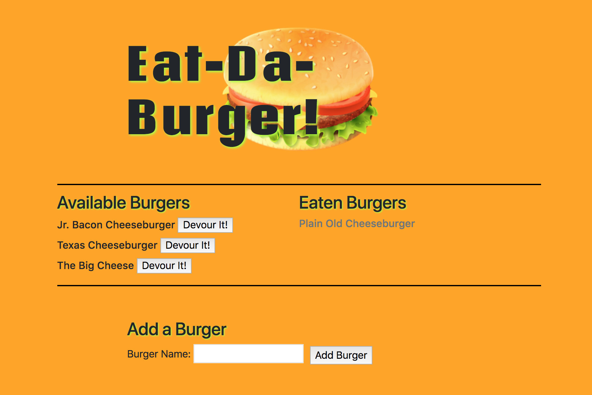

# Eat-Da-Burger

This app is a burger logger that follows the MVC design pattern and uses Sequelize, Node, Express, and Handlebars.

* Eat-Da-Burger! is a restaurant app that lets users input the names of burgers they'd like to eat.

* Whenever a user submits a burger's name, the app displays the burger on the left side of the page as an Available Burger.

* Each available burger in the waiting area also has a `Devour it!` button. When the user clicks it, the burger moves to the right side of the page as an Eaten Burger.

* The app stores every burger in the database, whether devoured or not.

Eat-Da-Burger: 

Webpage: https://ancient-forest-16024.herokuapp.com/
